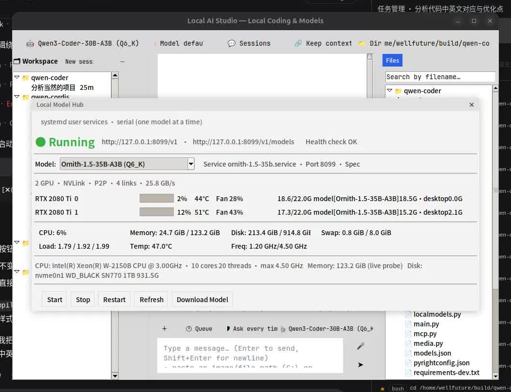

# Local AI Studio

**English** | [简体中文](README.zh-CN.md)

A local coding assistant with a **Tkinter GUI**, a **local Qwen** backend (DFlash2-accelerated), and streaming function-calling. The UI is **bilingual (English by default)** — switch via the model menu → 🌐 Language, persisted in the `language` field of `models.json` (`en`/`zh`).

Local GPU model management is built in via the embedded `gpulocal/` panel (start/stop/switch models, live GPU/system/hardware status).

> 📊 **Hardware & models write-up**: [2080Ti Second Spring — Qwen3.8-27B (DFlash2) / Qwen3-VL-32B / Ornith-1.5-35B-A3B](docs/2080ti-second-spring.md) — how two RTX 2080 Ti (44 GiB, NVLink) run three local models, and why llama.cpp over vLLM on this rig.

## Screenshots

<table>
  <tr>
    <td align="center"><br><em>Embedded local model panel</em></td>
    <td align="center"><br><em>Main coding interface</em></td>
  </tr>
</table>

## Features

- **Streaming chat** — body & reasoning stream live, progress spinner while running
- **Tool calling** — the model autonomously calls 8 built-in tools for coding tasks
- **Web search** — `web_search` tool (DuckDuckGo, zero deps, no API key needed)
- **MCP external tools** — connect any local stdio / remote HTTP MCP server, tools auto-discovered
- **📎 Attachment vision** — send images with a message (needs a vision model), audio/video by path
- **Embedded media** — inline images, GIFs, audio player, video thumbnails in chat
- **Copyable chat** — selectable text, Ctrl+C, right-click menu (copy / select all)
- **Auto attachment analysis** — txt/md/csv inlined; docx/pdf text extracted; zip/tar.gz extracted to `extract/` with a file manifest; rar/7z handled via `run_shell`
- **Multi-session** — auto-save, history switching, per-directory grouping, global search
- **Context compaction** — auto truncate/collapse long conversations (DeepSeek Harness style)
- **Token stats** — usage, cache hit rate, fast-reply savings shown live
- **Cache layer** — SQLite / memory backends, duplicate requests answered instantly
- **Codebase index** — semantic search over the project (opencode-codebase-index style)
- **Model management** — multiple providers, add/edit/delete, custom endpoints, vision models
- **🖥 Local GPU models** — embedded `gpulocal/` panel; start/stop/switch local models from the model dropdown, live status
- **🔗 Auto link fetching** — image URLs downloaded for vision; web pages fetched for the model (background thread)
- **Voice input** — one button: hold to talk (release to transcribe) or quick-tap for auto-pause (local Whisper)
- **Bundled fonts** — JetBrains Mono + Noto Sans CJK shipped, consistent across platforms
- **Three permission modes** — read-only / ask every time / always allow
- **Workspace switching** — switch projects, relative paths based on the selected dir
- **Cross-platform** — Linux / Windows / macOS

## Architecture

```
local-ai-studio/
├── config.py     # endpoints, models, generation params, system prompt
├── llm.py        # OpenAI-compatible streaming client (tool_calls chunking + usage)
├── tools.py      # 8 built-in tools + executor + permission tiers
├── mcp.py        # MCP client (stdio subprocess / remote HTTP + tool discovery)
├── media.py      # media support (images/GIF/audio/video thumbnails)
├── agent.py      # function-calling loop + permissions + usage + multimodal
├── context.py    # context compaction (budget + truncate + collapse)
├── cache.py      # cache layer (SQLite/memory, auto fallback)
├── codeindex.py  # codebase index (chunk + TF-IDF + SQLite search)
├── localmodels.py# local GPU model bridge (embedded gpulocal registry + cross-platform controls)
├── gpulocal/     # embedded local model panel (local_model_panel.py + services/ + setup.ps1)
├── weblinks.py   # auto-fetch links (image download / web page text)
├── sessions.py   # multi-session (save/switch/search/dir binding)
├── voice.py      # voice input (PortAudio + local Whisper)
├── ui.py         # Tkinter UI (models/cache/MCP/sessions + media + help)
├── fonts/        # bundled fonts (JetBrains Mono + Noto Sans CJK)
└── main.py       # entry point
```

Data flow:

```
user question → Agent.run()
  → llm.stream_chat() streaming request (with tools schema)
  → model returns tool_calls or final text
  → if tool calls: approval (ask mode) → tools.execute_tool() → feed back results
  → loop until no more tool calls
  → final text returned and streamed
```

## Tools

| Tool | Description | Permission |
|---|---|---|
| `read_file` | Read a file (with line numbers) | read |
| `list_dir` | List a directory | read |
| `glob_search` | Find files by wildcard | read |
| `grep_search` | Search contents | read |
| `index_search` | Semantic codebase search (relevant code chunks) | read |
| `web_search` | Web search (DuckDuckGo, no API key) | read |
| `write_file` | Write / overwrite a file | **write** |
| `run_shell` | Run a shell command | **write** |

## Web search

`web_search` uses the DuckDuckGo HTML endpoint (title/URL/snippet, default 8, max 10), no dependencies or API key. Ask anything needing current info (versions, news, docs) and the model calls it automatically.

## 🖥 Local GPU models (embedded gpulocal)

The local model panel lives under `gpulocal/` and is maintained inside this repo, making Local AI Studio a local model launcher. One-click setup per platform: `bash gpulocal/setup.sh` (Ubuntu/NVIDIA: CUDA + llama.cpp-dflash2 + systemd), `powershell -File gpulocal/setup.ps1` (Windows), `bash gpulocal/setup-mac.sh` (macOS: Homebrew llama.cpp with Metal); each supports a `download`-only mode for models.

- **Auto registry sync** — on startup reads gpulocal's `MODELS` registry (mtime-cached) into `models.json` as `gpulocal-8097/8098/8099` providers; edits on the other side follow automatically
- **One-click start/stop from the dropdown** — each local model shows a live status dot (`●` ready / `◐` loading / `○` stopped); submenu ▶ Start / ■ Stop / ↻ Restart; auto-selects a model once ready
- **Serial management** — starting one model stops the others (44 GiB VRAM fits one at a time)
- **Two-way dynamic sync** — both sides operate the same `systemctl --user` services (Linux) / background processes (Windows/macOS); a change on either side is reflected within ~4s
- Models with `mmproj` are auto-marked vision (`vision: true`)
- Degrades gracefully if `gpulocal/` is absent

## MCP external tools

Model menu → 🔌 Manage MCP servers. Two transports:

- **Local stdio** — spawned as a subprocess (`command` + `args`), JSON-RPC 2.0 line-delimited
- **Remote streamable HTTP** — `url` (optional `headers`), POST, JSON or SSE

Config lives in `~/.config/local-ai-studio/mcp.json`:

```json
{"servers": {"name": {"command": "...", "args": [], "url": "", "headers": {}, "enabled": true, "readonly": false}}}
```

Tools are named `mcp_<server>_<tool>` and merged into the model's tool table. `readonly` servers skip approval and are cacheable; unmarked are writable (ask mode needs confirm). MCP images are saved to `media/` and embedded. Example: `python3 examples/mcp_echo_server.py`.

## 📎 Attachments & media

- **📎 Attach** — multi-select images/audio/video with the message (privacy bar has per-item ✕)
- **Images** — converted to data URLs for vision (needs `"vision": true` on the model), downscaled to ≤1568px
- **Audio/video** — attach path + note; model analyzes with ffmpeg/ffprobe
- **Inline in chat** — images shown, GIFs animated, audio with ▶/⏸ player, video with ffmpeg first-frame thumbnail; double-click or "Open externally"; MCP images embedded too
- Chat text selectable, Ctrl+C, right-click copy/select-all
- Optional `pip install Pillow` for more formats (PNG/GIF work without it)

## Cache (speed + save tokens)

- **LLM reply cache** — identical model+messages+tools requests return cached reply
- **Tool result cache** — read-only tools cached within a short window
- **Two backends** (model menu → ⚡ Manage cache): SQLite (`cache.db`, survives restart) and memory (process-only); `auto` uses SQLite, falling back to memory
- Settings in `~/.config/local-ai-studio/cache.json`; UI can tune TTLs (LLM 3600s / tool 300s) and clear the cache
- Stats bar shows token usage, KV cache hit rate, fast-reply count

## Codebase index (opencode-codebase-index style)

Not stuffing code into the prompt — parse → chunk → vectorize (TF-IDF) → SQLite. The model uses `index_search` to fetch relevant chunks (with file+line), then reads them, saving many tokens.

- **Code-aware tokenization** — camelCase/snake_case split, Chinese comments bigram-indexed, en+zh queries supported
- **Incremental** — skips unchanged files by mtime/size; builds on first use
- **Storage** — `~/.config/wellfuture-coder/index/<workspace-hash>.db`, skips .git/node_modules/build
- UI: model menu → 🗂 Rebuild code index

## Multi-session

- **Auto-save** — persisted at send time (crash-safe)
- **Directory binding** — each session records its workspace; menu shows only the current dir's sessions
- **Global search** — by title/content across projects (＋ New session → 🔍)
- **Auto-switch dir** — opening another project's session switches to its workspace
- Storage: `~/.config/local-ai-studio/sessions/*.json` (OpenAI-format messages)

## Context compaction (DeepSeek Harness style)

Over budget (~24000 tokens) auto-compacts and notifies before/after usage:

1. Stage 0: truncate any oversized tool result (old rounds 400 chars / recent 3000)
2. Stage 1: further compress old tool results if still over
3. Stage 2: collapse middle rounds into summary lines (keep system + first question + last 2 rounds)

## Model management

- Multiple providers (local Qwen / Qwen2.5-VL vision / DeepSeek / custom OpenAI-compatible)
- Add: one endpoint + key can hold multiple model IDs; auto-fetch the endpoint's `/models` list
- Edit: display name / model ID / endpoint / key
- Vision: set `"vision": true` to accept image attachments
- Config: `~/.config/local-ai-studio/models.json` (old wellfuture-coder / qwen-coder dirs auto-migrate)

## Token stats

Bottom stats bar: token usage (in/out/think) & request count, KV cache hits, fast-reply count & estimated savings. Click to reset.

## Permission modes

| Mode | Behavior |
|---|---|
| `readonly` | Only read-only tools; no writes |
| `ask` (default) | Confirm before write tools (Allow / Deny) |
| `always` | Run directly, no confirmation |

## Running (Linux / Windows / macOS)

Tkinter GUI (built into Python), PortAudio (sounddevice) for recording, faster-whisper for local ASR — cross-platform, no OS-specific deps.

```bash
pip install -r requirements.txt   # voice deps; skippable if not using voice
python3 main.py                   # Windows: python main.py
```

**Requires Python 3.12+.** On Windows, if the system Python is older, run the app from a venv; if no 3.12 interpreter is installed, get one via Miniconda (Windows-only guidance):

```bat
D:\miniconda3\Scripts\conda.exe create -n py312 python=3.12 -y
%USERPROFILE%\.conda\envs\py312\python.exe -m venv .venv
.venv\Scripts\python -m pip install -r requirements.txt
.venv\Scripts\python main.py
```

> Windows missing PortAudio? Reinstall sounddevice: `pip uninstall sounddevice && pip install sounddevice`.
> macOS mic permission: System Settings → Privacy & Security → Microphone → allow Python/Terminal.

**Config & data directory** — Linux/macOS: `~/.config/local-ai-studio/`; Windows: `%APPDATA%\local-ai-studio\`.
Holds `models.json`, `mcp.json`, `cache.json`, `state.json`, `sessions/`, `index/`, `media/`.
Old config dirs from previous names (`wellfuture-coder`, and the earlier `qwen-coder`) auto-migrate on first run.

### Packaging

```bash
pip install pyinstaller
pyinstaller --onefile --windowed --name LocalAIStudio main.py   # Linux / Windows
pyinstaller --windowed --name LocalAIStudio main.py             # macOS
```

> `LocalAIStudio.spec` is included: it excludes torch/faster-whisper/onnx, dropping size from ~3.9GB to ~69MB. Use `pyinstaller LocalAIStudio.spec`.

## Backend dependency

Local Qwen inference service (`qwen38-27b-q8.service`, port 8097, DFlash2 speculative decoding).

- Endpoint: `http://127.0.0.1:8097/v1`
- Model: `qwen3.8-27b-q8`
- Vision model: `qwen2.5-vl-7b` (`http://127.0.0.1:8099/v1`, `"vision": true`)

## Security notes

- `run_shell` / `write_file` really execute system commands / write files; default `ask` mode is safest
- Built-in sandbox guardrails (on by default, `LAS_SANDBOX=off` to disable): `write_file` is confined to the workspace; `run_shell` rejects obviously destructive commands (rm -rf /, mkfs, disk format, shutdown, fork bombs). Guardrail, not OS-level isolation
- Tool exec timeout (`TOOL_EXEC_TIMEOUT=60s`) and round cap (`MAX_TOOL_ROUNDS=20`) prevent runaway loops
- No full sandbox yet — avoid letting the model process untrusted instructions in `always` mode

## Development

```bash
pip install -r requirements-dev.txt
python -m pytest tests/ -q     # 122 unit tests; LLM transport mocked, HOME/APPDATA isolated
```

CI: `.github/workflows/test.yml` runs py_compile + pytest on ubuntu / windows / macos × Python 3.12. UI dialogs live in `ui_panel_*.py` modules (extracted from `ui.py`); `App` methods are thin delegates.
