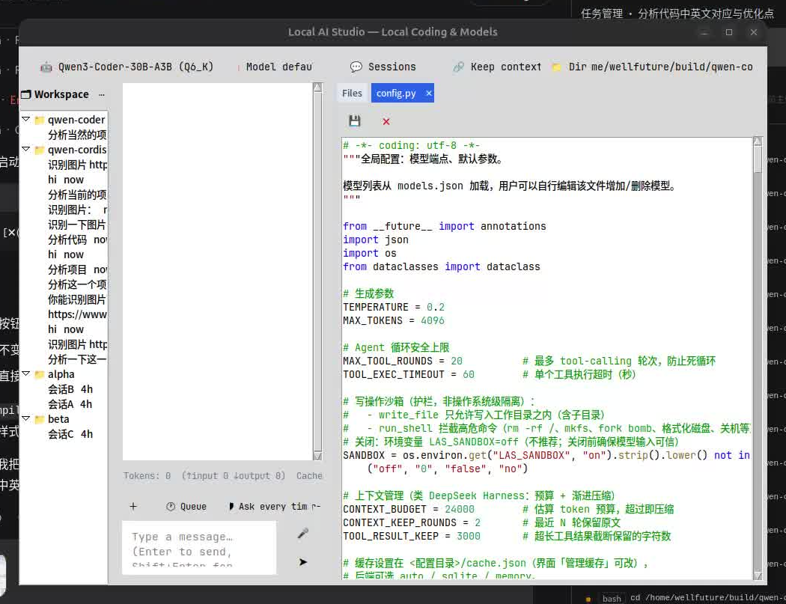

# Local AI Writer

**English** | [简体中文](README.zh-CN.md)

**Local AI Writer** is a desktop AI writing studio for **short-drama screenplays (短剧) and web novels (网文)** — a Tkinter GUI backed by any OpenAI-compatible model, with streaming chat and an agent that actually reads and writes your manuscript files in a project directory. Python 3.12+, Linux / Windows / macOS.

Everything runs on your machine: no account, no bundled cloud service. Your manuscripts leave the computer only if you point the app at a cloud endpoint you configure yourself. The UI is bilingual (English / 简体中文) — switch via the model menu → 🌐 Language, persisted in `models.json`.

> This repo is the standalone home of the writing product, carved out of the **Local AI Studio** kernel ("one kernel, multiple products"). The default product is `novelwriter` — `python main.py` boots straight into the writing UI. The sibling profiles (`devtool`, `devtool_local`, `quant`, `devrag`) still ship in `products/` as kernel by-products; see [Products](#products-one-kernel-many-faces).

## Screenshot



## Current status

**v0.1 — kernel migration.** The full creation kernel below works today: agent chat that writes real files, multi-root knowledge base, attachments, sessions, voice input, model management. The writing-specific panels from the roadmap (chapter tree, character cards, beat templates) are not built yet — [Roadmap](#roadmap).

## Why a writing studio on an agent kernel

Most AI writing tools confine you to a chat box and a copy button. Here the agent has hands:

- **Your manuscript is a project directory.** Drafts, outlines, and settings live as plain files; the model uses `read_file` / `write_file` to revise chapter 12 in place instead of re-printing the whole script into a chat bubble.
- **A knowledge base keeps the canon straight.** Index your worldbuilding docs, character sheets, and previous volumes in a persistent multi-root KB; the model retrieves the relevant fragments itself (`kb_search`) instead of you re-pasting settings into every prompt.
- **Reference material goes in as attachments.** docx/pdf/txt/md/csv are analyzed in place; zips are extracted with a manifest; images go to vision models.
- **Long serials don't blow the context.** Three-stage compaction (1M-token budget by default) keeps a running story coherent, and the stats bar shows what you're spending.

## Features

- **Streaming chat** — body & reasoning stream live; tool calls shown as cards
- **File-backed writing** — agent reads/writes files inside the chosen workspace; drafts survive the chat
- **Multi-root knowledge base (RAG)** — index 设定/素材/往期作品 directories into SQLite; TF-IDF retrieval with optional embedding boost; `kb_search` tool + optional auto-inject into context
- **Attachments** — multi-select files with a message; txt/md/csv inlined, docx/pdf text-extracted, zip/tar.gz extracted with a file manifest; images downscaled to ≤1568px and sent to vision models (`"vision": true`)
- **Inline media** — images/GIFs displayed, audio player, video thumbnails in chat; text selectable, Ctrl+C / right-click copy
- **Auto link fetching** — image URLs in a message are downloaded for vision; web pages are fetched and summarized for the model (background thread)
- **Web search** — `web_search` over DuckDuckGo, zero deps, no API key
- **Smart dispatch** — `call_model` tool delegates a heavy subtask (a brutal plot surgery, image understanding) to a stronger configured model; targets (simple / high-end / vision) managed in a panel
- **Voice input** — one button: hold to talk, or quick-tap for auto-pause detection (local Whisper, faster-whisper)
- **Multi-session** — auto-save at send time, per-directory grouping, global search across projects
- **Context compaction** — over-budget conversations auto-truncate tool results, then collapse old rounds into summaries (system + first question + recent rounds kept)
- **Cache layer** — identical requests answered instantly; SQLite (persists) or in-memory backend; live token / cache-hit / fast-reply stats
- **Model management** — multiple providers, add/edit/delete, custom endpoints, `/models` auto-fetch, per-model vision & reasoning-effort flags
- **Three permission modes** — readonly / ask (default) / always, with sandbox guardrails
- **Workspace switching** — switch between works; relative paths follow the selected directory
- **Bundled fonts** — JetBrains Mono + Noto Sans CJK, consistent across platforms

## A writing session

```bash
mkdir 我的短剧 && python main.py     # then pick 我的短剧 as the workspace
```

1. Attach `大纲.docx` and ask: *“把大纲拆成 20 集的分集梗概，保存到 分集梗概.md”*
2. *“读分集梗概，把第 1 集扩写成 1200 字短剧剧本，存到 剧本/EP01.md，开场 30 秒内放钩子”*
3. Next day, open the session again (auto-saved), or switch to another work's directory — sessions are grouped per project.
4. Point the KB at your 设定集/ folder so character settings are retrieved automatically while writing.

## Tools

| Tool | What it does | Permission |
|---|---|---|
| `read_file` | Read a file (with line numbers) | read |
| `write_file` | Write / overwrite a file | **write** |
| `list_dir` | List a directory | read |
| `glob_search` | Find files by wildcard | read |
| `grep_search` | Full-text search across the work | read |
| `index_search` | Semantic search over the workspace index | read |
| `web_search` | Search the web (DuckDuckGo, no key) | read |
| `run_shell` | Run a shell command (e.g. ffmpeg, pandoc exports) | **write** |
| `call_model` | Delegate a subtask to another configured model | read |
| `kb_search` | Retrieve fragments from the multi-root knowledge base | read |

(`lsp_diagnostics` also ships as a kernel tool; it only matters for code-like projects.)

## Architecture

```
main.py → ui.launch() → App (Tkinter mainloop; one worker thread per message)
   └─ agent.Agent.run()     synchronous function-calling loop
        ├─ llm.py           OpenAI-compatible SSE streaming client (stdlib urllib)
        ├─ tools.py         built-in tools + executor + permission tiers + sandbox
        ├─ codera.py        multi-root knowledge base (TF-IDF + optional embedding)
        ├─ context.py       token budget + three-stage compaction
        ├─ cache.py         LLM/tool cache (SQLite WAL / memory)
        ├─ sessions.py      session DB (SQLite, per-directory grouping)
        ├─ attach.py        docx/pdf/zip attachment analysis
        ├─ voice.py         PortAudio capture + faster-whisper
        └─ weblinks.py      auto-fetch links from messages
```

**Agent loop**: stream chat request (with tool schemas) → tool_calls? → approval in `ask` mode → execute sandboxed → feed results back → repeat (≤ 12 rounds) → final text streamed.

## Products: one kernel, many faces

The repo root is the shared kernel; `products/<name>/profile.json` defines a product's brand and feature gates (`import products; products.feature("rag")`). This repo's default product:

| Gate | Value | Meaning |
|---|---|---|
| `dispatch` | ✅ | smart routing + `call_model` enabled |
| `rag` | ✅ | knowledge base + `kb_search` enabled |
| `attachments` / `sessions` / `voice` | ✅ | attachments, multi-session, voice input |
| `gpulocal` | ❌ | no embedded local-GPU model panel |
| `mcp` | ❌ | no external MCP tool servers |
| `editor` | ✅ | side file tree + editor panel |

Sibling profiles (`devtool`, `devtool_local`, `quant`, `devrag`) are still runnable for kernel development: `LOCAL_AI_PRODUCT=devtool python3 main.py`, or `python3 products/<name>/run.py`.

## Getting started

**Python 3.12+ required; 3.14+ recommended.** Python 3.14 bundles Tcl/Tk 9.0, whose color-emoji engine draws the toolbar icons in color — on 3.12/3.13 (Tk 8.6) they render as monochrome glyphs on Windows.

```bash
pip install -r requirements.txt   # numpy/sounddevice/faster-whisper (voice), psutil, tkinterdnd2
python3 main.py                   # Windows: python main.py
```

Voice deps are optional — skip them (and the voice button degrades) if you don't dictate. On Windows, install Python 3.14+ from [python.org](https://www.python.org/downloads/), or bootstrap 3.12 via Miniconda:

```bat
D:\miniconda3\Scripts\conda.exe create -n py312 python=3.12 -y
%USERPROFILE%\.conda\envs\py312\python.exe -m venv .venv
.venv\Scripts\python -m pip install -r requirements.txt
.venv\Scripts\python main.py
```

> Windows missing PortAudio? `pip uninstall sounddevice && pip install sounddevice`.
> macOS mic permission: System Settings → Privacy & Security → Microphone → allow Python/Terminal.

**Models** — first run seeds `models.json` with a local Qwen endpoint as default plus a DeepSeek placeholder. If you don't run a local backend, open model management (模型 menu → add provider) and enter any OpenAI-compatible endpoint with your own key: DeepSeek, Kimi, GLM, OpenAI, or a local llama.cpp/vLLM server. Mark vision models with `"vision": true` to use image attachments.

**Config & data directory** — Linux/macOS: `~/.config/local-ai-studio/`; Windows: `%APPDATA%\local-ai-studio\` (shared kernel name; legacy `wellfuture-coder` / `qwen-coder` dirs auto-migrate). Holds `models.json`, `cache.json`, `state.json`, `sessions/`, `index/`, `media/`, `extract/`.

## Packaging

```bash
pip install pyinstaller
python packaging/build.py novelwriter          # → dist/LocalAIWriter-<platform>/
python packaging/build.py novelwriter --clean  # rebuild without cache
```

The build is product-aware: `profile.json` decides the exe name (`LocalAIWriter`) and drops the AI heavy stack (torch/faster-whisper/onnx excluded, ~tens of MB). CI (`.github/workflows/test.yml`) runs tests and builds packages on ubuntu / windows / macos.

## Roadmap

From [`PLAN-五产品矩阵.md`](PLAN-五产品矩阵.md) (product 3; market analysis in [`PLAN-市场前景分析.md`](PLAN-市场前景分析.md)):

| Version | Scope |
|---|---|
| v0.1 ✅ | Kernel migration: chat, model management, sessions, file-backed writing (this repo today) |
| v0.5 | Creation skeleton: chapter-tree panel, character cards, worldbuilding cards, style templates, serialization management; txt/docx export |
| v1.0 | Template library: short-drama hook structures (first-3-episode hooks, paywall cliffhangers), web-novel pacing templates (golden three chapters, payoff density); shareable configs |
| v1.1 | Sensitivity/compliance check, multi-model comparative drafting, rewrite/expand/continue commands |

## Security notes

- `run_shell` / `write_file` really execute commands and write files; the default **ask** mode confirms every write
- Sandbox guardrails (default on, `LAS_SANDBOX=off` to disable): `write_file` is confined to the workspace; `run_shell` rejects obviously destructive commands (rm -rf /, mkfs, shutdown, fork bombs). Guardrails, not OS-level isolation
- Tool execution timeout (60 s) and a 12-round cap prevent runaway loops
- Avoid `always` mode when feeding the model untrusted text

## Development

```bash
pip install -r requirements-dev.txt
python -m py_compile *.py            # syntax gate (same as CI)
python -m pytest tests/ -q           # 294 unit tests; LLM transport mocked, HOME/APPDATA isolated
```

Core modules import stdlib only; optional deps (numpy, faster-whisper, psutil, Pillow, tkinterdnd2) degrade gracefully. UI dialogs live in `ui_panel_*.py`. Conventions in [`AGENTS.md`](AGENTS.md).

## License

[Mulan Permissive Software License, v2](LICENSE) (木兰宽松许可证，第2版).
